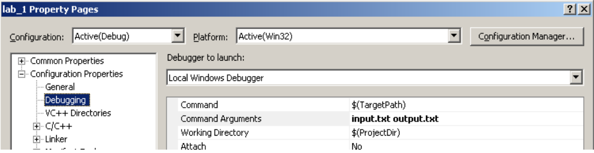

Параметры командной строки 
- передаются операционной системой при запуске приложения 
- для отладки могут устанавливаться в среде разработки 
- включают имя самого приложения 
```int main(int argc, char* argv [])```


Пример использования параметров командной строки
```cpp
int main(int argc, char* argv[]) {
  // argc количество аргументов
  if (3 < argc) {
    string pathIn(argv[1]); 
    string pathOut(argv[2]); 
    ... 
  }
...
}
``````
Как отлаживать использование параметров командной строки
в настройках проекта

Command                       ${TargetPath} 
Command Arguments    *параметры*
Working Directory          ${TargetDir} или ${ProjectDir}